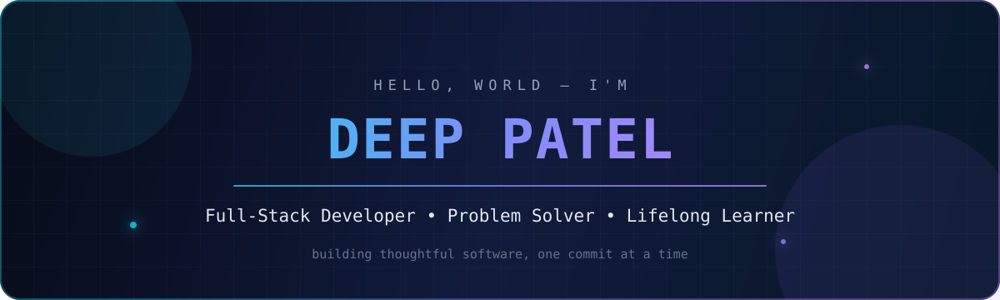
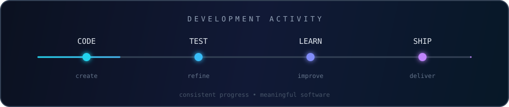

<div align="center">
  

  <br />

<a href="https://github.com/DeepPatel25"></a>
<a href="https://www.linkedin.com/in/deep-patel-090937390/"></a>


<br /><br />

  
</div>

## About me

```ts
const deep = {
  role: "Full-Stack Developer",
  education: "B.E. in Computer Engineering — GEC Rajkot",
  currentFocus: [
    "TypeScript",
    "real-time applications",
    "clean backend systems",
  ],
  enjoys: [
    "solving problems",
    "learning new technology",
    "building useful products",
  ],
  principle: "Stay curious. Build clearly. Improve continuously.",
};
```

I enjoy taking an idea from a rough sketch to a working product—designing the interface, building the backend, connecting the pieces, and learning whatever the problem demands. My repositories trace that journey from Python, Django, and C++ fundamentals to modern TypeScript, JavaScript, C#, Docker, and multi-client applications.

- 🔭 Currently exploring scalable, real-time full-stack systems
- 🧠 Strengthening data structures, algorithms, and system design
- 🤝 Open to collaborating on useful web and open-source projects
- ⚡ I believe consistent small improvements create excellent software

## What I work with

<div align="center">

| Area             | Technologies                                                                                                                                                                                                                                                                                                                                                                                                                                           |
| :--------------- | :----------------------------------------------------------------------------------------------------------------------------------------------------------------------------------------------------------------------------------------------------------------------------------------------------------------------------------------------------------------------------------------------------------------------------------------------------- |
| **Languages**    |      |
| **Frontend**     |                                                                                                                                                                                                           |
| **Backend**      |                                                                                                                                                                                              |
| **Data & Tools** |                                                                                                                        |

</div>

## Selected work

<table>
  <tr>
    <td width="50%" valign="top">
      <h3>💬 Chatter</h3>
      <p>A Dockerized communication project organized across backend, web, and mobile clients—a practical exploration of building one product for multiple platforms.</p>
      <p><code>TypeScript</code> <code>Docker</code> <code>Web</code> <code>Mobile</code></p>
      <a href="https://github.com/DeepPatel25/Chatter">View repository →</a>
    </td>
    <td width="50%" valign="top">
      <h3>📡 Video Stream</h3>
      <p>A JavaScript video-streaming experiment with a separated frontend and server, focused on real-time media delivery and client-server communication.</p>
      <p><code>JavaScript</code> <code>Node.js</code> <code>Streaming</code></p>
      <a href="https://github.com/DeepPatel25/Video-Stream">View repository →</a>
    </td>
  </tr>
  <tr>
    <td width="50%" valign="top">
      <h3>🏫 School Management System</h3>
      <p>A backend-focused design engineering project for organizing and managing school workflows and information.</p>
      <p><code>Backend</code> <code>HTML</code> <code>Design Engineering</code></p>
      <a href="https://github.com/DeepPatel25/School-Management-System">View repository →</a>
    </td>
    <td width="50%" valign="top">
      <h3>🧩 Code & Algorithms</h3>
      <p>An evolving collection of programming practice, problem-solving work, and algorithm implementations across languages.</p>
      <p><code>C++</code> <code>DSA</code> <code>Problem Solving</code></p>
      <a href="https://github.com/DeepPatel25/Code">View repository →</a>
    </td>
  </tr>
</table>

## Engineering journey

```text
Foundations           Backend & Web              Modern Product Work
C++ · Python ───────── Django · JS · MySQL ───── TypeScript · Docker · Real-time apps
        │                       │                              │
   problem solving       full-stack thinking          multi-platform systems
```

My experience is built through hands-on product development: academic engineering work, competitive programming challenges, backend applications, browser projects, desktop utilities, and increasingly modern full-stack systems. Each project is a checkpoint in a longer journey toward building dependable, maintainable software.

## GitHub activity

<div align="center">
  <a href="https://github.com/DeepPatel25?tab=repositories">
    
  </a>
  <br /><br />
  
</div>

## Contribution trail

<div align="center">
  <picture>
    <source media="(prefers-color-scheme: dark)" srcset="https://raw.githubusercontent.com/DeepPatel25/DeepPatel25/output/github-contribution-grid-snake-dark.svg?v=2" />
    <source media="(prefers-color-scheme: light)" srcset="https://raw.githubusercontent.com/DeepPatel25/DeepPatel25/output/github-contribution-grid-snake.svg?v=2" />
    
  </picture>
</div>

<div align="center">
  <br />
  <i>Have an interesting idea or project? Let's build something worthwhile.</i>
  <br /><br />
  <a href="https://www.linkedin.com/in/deep-patel-090937390/"></a>
  <br /><br />
  <sub>Designed with curiosity, code, and a little motion ✦</sub>
</div>
